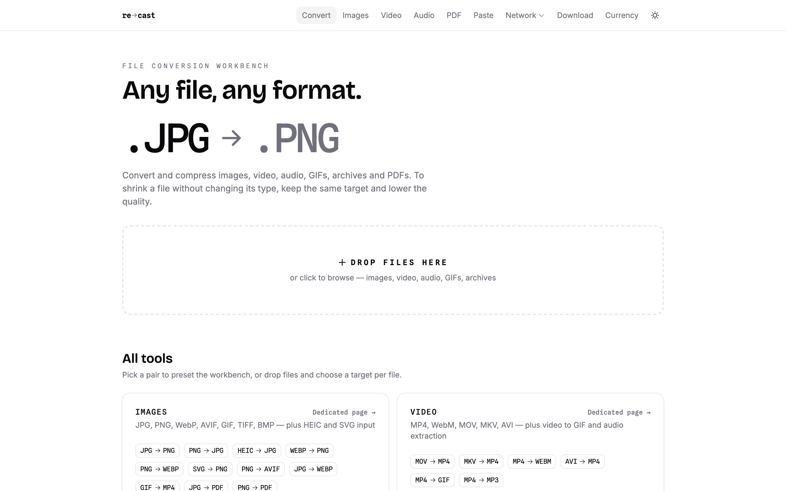
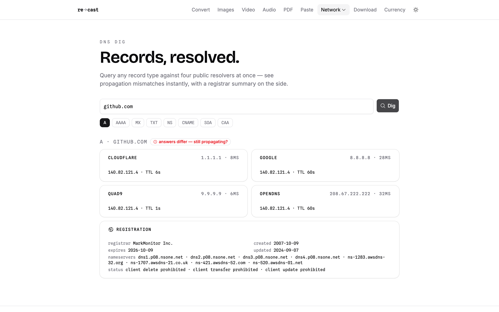
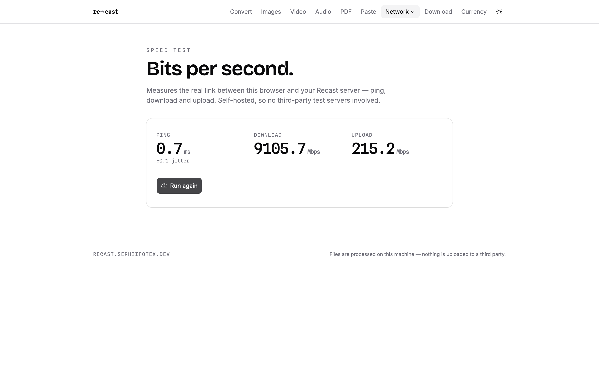
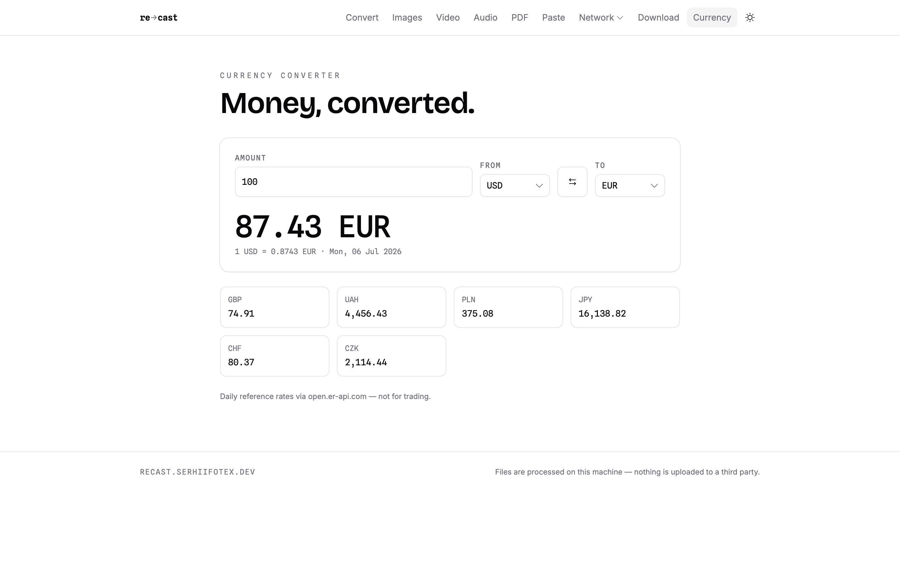
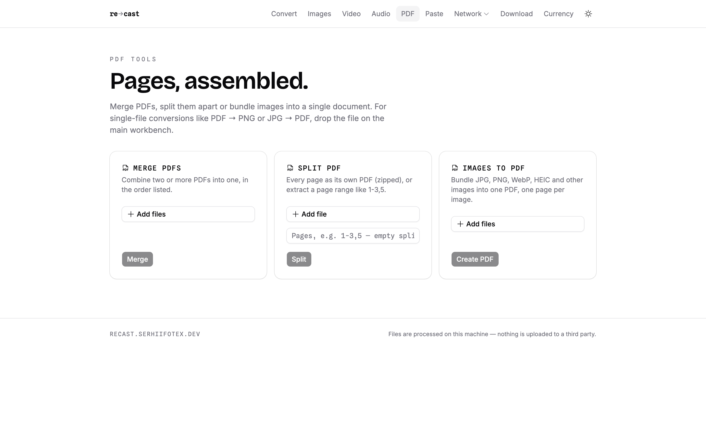

<p align="center">
  
</p>

<h1 align="center">Recast</h1>

<p align="center">
  <strong>Every format you need.</strong><br />
  A self-hosted toolbench — file conversion, PDF tools, media downloader,
  website screenshots, DNS dig, IP inspector, speed test, private pastebin and
  a currency converter. Your files never leave your machine.
</p>

<p align="center">
  <code>convert</code> · <code>pdf</code> · <code>paste</code> · <code>screenshot</code> ·
  <code>dig</code> · <code>ip</code> · <code>speed</code> · <code>download</code> · <code>currency</code>
</p>

<p align="center">
  <a href="https://recast.serhiifotex.dev">recast.serhiifotex.dev</a> ·
  <a href="VISION.md">vision</a> ·
  <a href="ROADMAP.md">roadmap</a>
</p>

<p align="center">
  <a href="LICENSE"></a>
  
  
</p>

<a href="https://recast.serhiifotex.dev">
  <picture>
    <source media="(prefers-color-scheme: dark)" srcset=".github/screenshot-dark.png" />
    
  </picture>
</a>

## Tools

- **Convert** — the universal workbench: drop any mix of files, pick a target
  and quality per file, convert in parallel. Dedicated pages at `/images`,
  `/video` and `/audio`.
  - Images: JPG, PNG, WebP, AVIF, GIF, TIFF, BMP, plus HEIC and SVG input
  - Video: MP4, WebM, MOV, MKV, AVI, video → GIF (two-pass palette), GIF → video
  - Audio: MP3, WAV, OGG, Opus, FLAC, AAC, M4A, plus extraction from video
  - Archives: ZIP ↔ TAR / TAR.GZ / TAR.BZ2 / TAR.XZ / 7Z
  - Compression: keep the format, lower the quality knob
- **PDF** — merge, split by pages or ranges, images → one PDF, PDF ↔ images
- **Paste** — link-only or private pastes with tags, description and expiry;
  Google sign-in required to create
- **Screenshot** — capture any URL as PNG/JPG with viewport presets, delay,
  full-page, dark mode and 2× retina
- **DNS dig** — any record type against four public resolvers at once, with
  propagation consistency check and RDAP registrar summary
- **IP inspector** — your public address, ISP, geo and reverse DNS, plus what
  your browser reveals
- **Speed test** — ping, download and upload between browser and server
- **Download** — video (MP4) or audio (MP3) from YouTube, SoundCloud and 1,800+ sites
- **Currency** — 160+ currencies with daily rates, cached server-side

## A look around

<table>
  <tr>
    <td width="50%">
      <picture>
        <source media="(prefers-color-scheme: dark)" srcset=".github/dig-dark.png" />
        
      </picture>
      <p align="center"><sub><b>DNS dig</b> — four resolvers at once, mismatches flagged, RDAP on the side</sub></p>
    </td>
    <td width="50%">
      <picture>
        <source media="(prefers-color-scheme: dark)" srcset=".github/speed-dark.png" />
        
      </picture>
      <p align="center"><sub><b>Speed test</b> — ping, download and upload against your own server</sub></p>
    </td>
  </tr>
  <tr>
    <td width="50%">
      <picture>
        <source media="(prefers-color-scheme: dark)" srcset=".github/currency-dark.png" />
        
      </picture>
      <p align="center"><sub><b>Currency</b> — 160+ currencies, daily rates cached server-side</sub></p>
    </td>
    <td width="50%">
      <picture>
        <source media="(prefers-color-scheme: dark)" srcset=".github/pdf-dark.png" />
        
      </picture>
      <p align="center"><sub><b>PDF tools</b> — merge, split by ranges, bundle images into one document</sub></p>
    </td>
  </tr>
</table>

## Getting started

```sh
bun install
bun run dev
```

Open http://localhost:3000.

Local requirements: [bun](https://bun.sh) ≥ 1.3, `ffmpeg` and `yt-dlp` on `PATH`
(`brew install ffmpeg yt-dlp`), and `bsdtar` (preinstalled on macOS).

### Database & Google sign-in (pastebin)

The pastebin stores pastes and accounts in Postgres — a free
[Supabase](https://supabase.com) project works out of the box:

1. Create a project, copy the pooler connection string into `DATABASE_URL`
   (see [.env.example](.env.example)).
2. Create a Google OAuth client in the
   [Google Cloud console](https://console.cloud.google.com/apis/credentials)
   with redirect URI `<your-url>/api/auth/callback/google`; set
   `GOOGLE_CLIENT_ID`, `GOOGLE_CLIENT_SECRET` and a long random
   `BETTER_AUTH_SECRET`.
3. Apply the auth schema once:

```sh
bunx @better-auth/cli migrate --config src/server/auth.ts -y
```

The paste table creates itself on first use. Everything else works without a
database — the paste endpoints return a clear 503 until it's configured.

## Production

```sh
bun run build
bun start
```

`bun start` runs [`server.mjs`](server.mjs) — a small Bun server that serves
built client assets with immutable caching and hands everything else to the
TanStack Start handler.

### Docker

```sh
docker compose up --build
```

The image bundles FFmpeg, yt-dlp, bsdtar, libheif and Chromium. Configure via
`.env` (picked up by compose) — see [.env.example](.env.example).

## Why

Read [VISION.md](VISION.md) — the short version: every online converter asks
you to trust a stranger's server with your files. Recast is the same
convenience on your own machine, where trust isn't required.

## License

[MIT](LICENSE)
